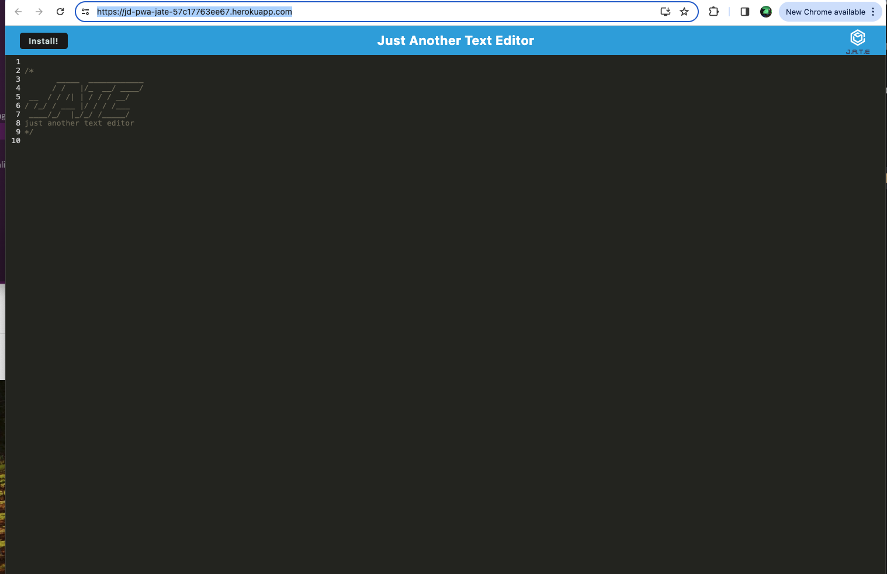

# TextEditor

## Table of Contents

1. [Description](https://github.com/johndennis2/texteditor/blob/main/README.md###Description)
2. [Useage](https://github.com/johndennis2/texteditor/blob/main/README.md###Useage)
3. [Technologies](https://github.com/johndennis2/texteditor/blob/main/README.md###Technologies)
4. [Authors](https://github.com/johndennis2/texteditor/blob/main/README.md###Authors)
5. [Screenshot](https://github.com/johndennis2/texteditor/blob/main/README.md###Screenshot)

## Description
This a Text Editor. It is a versatile web application designed to facilitate efficient note-taking and code snippet creation for developers. Whether online or offline, this application ensures reliability in storing and retrieving essential information, enabling developers to seamlessly capture ideas, code snippets, and insights anytime, anywhere.

## Usage
This application serves as a reliable tool for developers to:
-Take notes and jot down ideas without being constrained by internet connectivity.
-Create and store code snippets for later reference and use.
Enjoy a seamless user experience with features such as IndexedDB integration for data storage, webpack bundling for efficient resource management, and service worker registration for offline access.
## Technologies
Developer's NoteTaker leverages the following technologies to provide a robust and user-friendly experience:

JavaScript: The primary programming language used for building the application logic and functionality.
React.js: A JavaScript library for building user interfaces, enabling the creation of interactive and dynamic components.
IndexedDB: A browser-based database system for storing large amounts of structured data client-side.
Webpack: A module bundler for JavaScript applications, facilitating the bundling of assets and resources for optimal performance.
Workbox: A set of libraries and build tools for adding offline support to web applications through service workers.
Render: A platform for deploying and hosting web applications, providing reliable infrastructure and deployment services.

## Authors

John Dennis is the author to learn more about him and his projects please visit his Git Hub at : https://github.com/JohnDennis2

## ScreenShot
